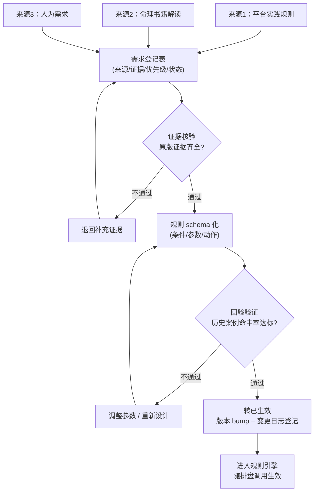
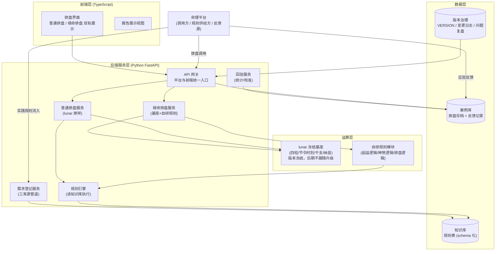
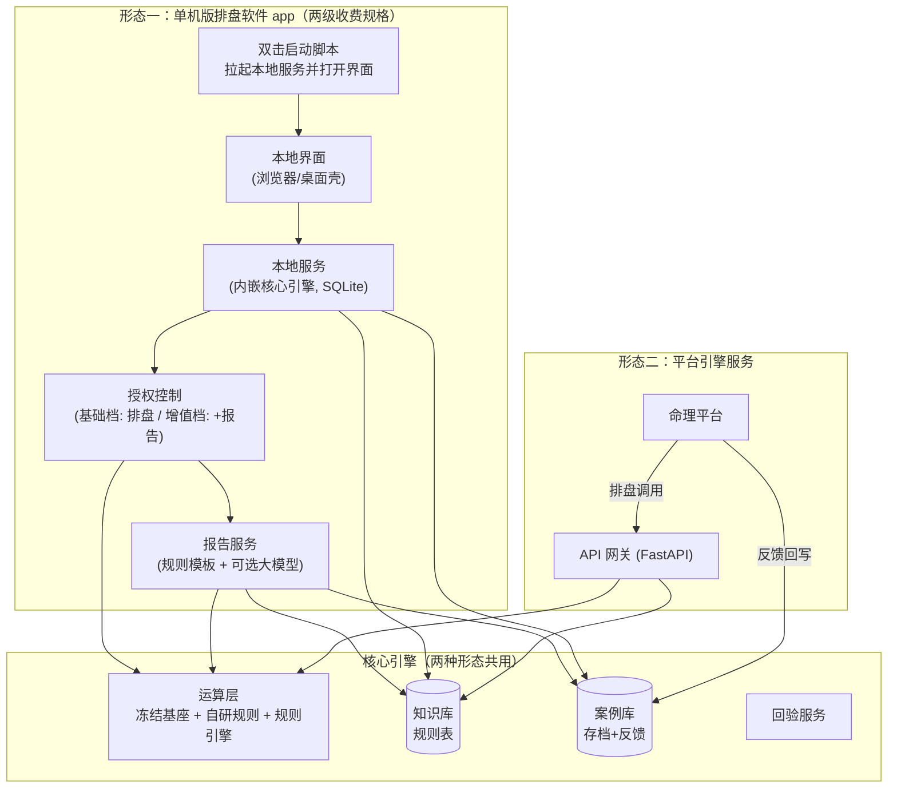
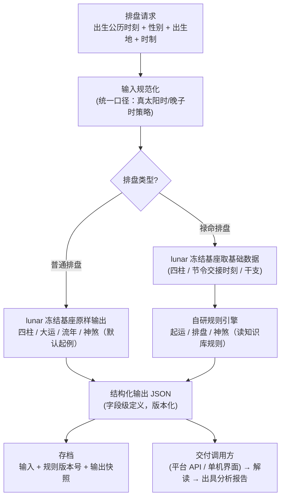
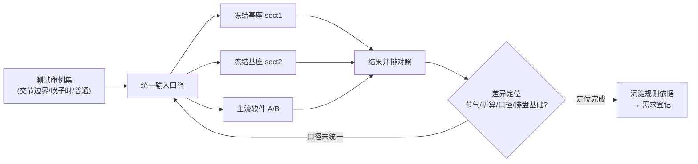
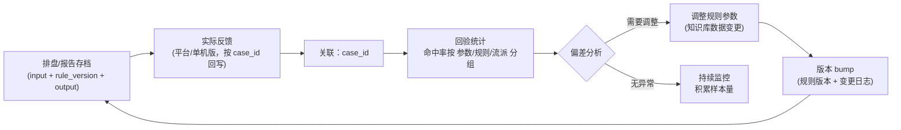

# 命理排盘工具 · 实施架构设计文档

> 版本：v0.5（草稿，待确认）
> 日期：2026-08-26
> 状态：设计讨论稿，未进入开发

---

## 1. 项目定位

本工具以**两种形态**存在，共享同一套核心引擎：

- **形态一（引擎服务）**：被命理平台调用的命理引擎服务。核心链路为：平台调用排盘 → 平台基于结果解读、出具命理分析报告 → 实际应验情况反馈 → 回验程序逻辑 → 校准规则 → 再服务平台。
- **形态二（单机版排盘软件 app）**：本地单机运行的排盘软件，不依赖平台，独立完成双轨排盘与本地案例记录；按**收费规格**分两档——基础档：仅排出计算结果；增值档：额外出具命理分析报告。

两种形态共用运算层、知识库结构、案例存档 schema 与版本治理，差异仅在"外壳"：单机版本地起服务，平台版部署到服务器。

工具的价值基线：

- **普通排盘**：完全照搬大众版（lunar 原样输出），作为行业标准盘与验证基准。
- **禄命排盘**：以冻结的 lunar 当前版本为基座，叠加自研的起运、排盘、神煞逻辑。
- **规则可持续演进**：命理规则以数据（而非代码）形式沉淀在知识库，支持增量新增。
- **回验闭环**：所有排盘结果存档，配合平台反馈做命中率统计与参数校准。

---

## 2. 需求来源与需求管理

### 2.1 需求三来源管道

开发需求统一来自三条管道，汇入一份需求登记表，每条需求必须带"来源"与"证据"标签：

| 来源 | 说明 | 证据要求 | 对应既有方法论 |
|---|---|---|---|
| 来源1：平台实践规则 | 命理平台（或单机版用户反馈）从实际案例中提取的规则，流入工具变成开发需求 | 平台/本地反馈案例（应验/不应验） | 实盘预验证 → 统计命中率 → 校准参数 |
| 来源2：命理书籍解读 | 平台对命理书籍解读后，可形成工具的部分，触发开发 | 原文出处（书籍章节/段落） | 精读 → 主题式解读 → 原版证据表 → 可编码信号清单 → 穷举核查表防遗漏 |
| 来源3：人为需求 | 用户根据认知与验证结果主动增加的需求 | 用户验证说明 | 问题复盘 / 持续演进 |

### 2.2 需求生命周期



**硬性准入规则**（承接既有纪律）：

- 来源1 需求：必须有平台或本地（单机版）反馈案例背书；
- 来源2 需求：必须有书籍原文出处，缺原版证据禁止上线；
- 来源3 需求：必须有用户验证说明，且优先走回验验证再上线。

### 2.3 需求登记表字段

每条需求登记时包含：

| 字段 | 说明 |
|---|---|
| 需求ID | 唯一编号（如 REQ-001） |
| 来源 | platform（平台实践）/ book（书籍解读）/ manual（人为） |
| 证据 | 反馈案例ID / 原文出处 / 验证说明 |
| 影响模块 | 起运 / 神煞 / 排盘 / 解读输出 |
| 优先级 | P0 / P1 / P2 |
| 状态 | 登记 → 证据核验 → 规则化 → 验证中 → 已生效 → 已废弃 |
| 关联规则ID | 落地后关联知识库中的规则记录 |

---

## 3. 系统总体架构

### 3.1 架构图



### 3.2 双形态部署图



单机版与平台版**共享同一套核心引擎**，差异仅在部署外壳与数据存放位置；本地规则通过"规则包导入/导出"与服务版同步。**回验闭环两形态共用**：单机版增值档出具报告同样进入案例存档，本地反馈（应验/不应验）回写后参与回验统计，与平台反馈同等效力。

### 3.3 分层职责

| 层 | 职责 | 关键约束 |
|---|---|---|
| 前端层 | 双轨排盘展示、报告展示、规则管理后台 | 普通/禄命并排呈现，差异一目了然 |
| 后端服务层 | API 网关、双轨排盘服务、报告服务、授权控制、规则引擎调度、回验服务、需求登记服务 | 对外输出字段级稳定，版本化 |
| 运算层 | lunar 冻结基座 + 自研规则模块 | 冻结基座不改源码；自研逻辑与基座边界清晰 |
| 数据层 | 知识库（规则表）、案例库（存档+反馈）、版本治理 | 规则数据化；案例含版本快照可追溯 |
| 单机版外壳 | 本地启动脚本、本地配置、规则包导入 | 复用后端服务逻辑；仅本机访问，不对外暴露 |

---

## 4. 双轨排盘设计

> 双轨排盘是核心引擎的入口逻辑，两种形态共用；差异仅在于"请求来源"（本地界面 / 平台 API）。

### 4.1 排盘请求处理流程



### 4.2 普通排盘

- 直接调用冻结基座的默认输出，**一行规则不动**。
- 角色：行业标准盘；禄命排盘的对照基准；起运差异验证的锚点。
- 与主流软件（问真、元亨利贞等）三方对照时，以本盘为内部基准。

### 4.3 禄命排盘

- 基座：复制冻结的 lunar 当前版本（vendor 进项目），后期不随 lunar 升级。
- 自研范围：起运逻辑、排盘逻辑、神煞逻辑，全部以自研模块实现。
- 数据来源：基座只提供"基础数据"（四柱、节令交接时刻、干支、纳音），自研规则消费这些数据后输出禄命结果。
- 冻结注意事项：
  1. 保留 MIT 版权头；
  2. 记录冻结版本号与日期（如"基于 lunar vX.Y.Z 冻结于 2026-08-26"）；
  3. 基座修复只做"挑拣式 cherry-pick"，不整体升级；
  4. 自研模块与基座代码物理隔离（独立目录），便于未来迁移或换底层。

---

## 5. 运算层设计

### 5.1 冻结基座（vendor/lunar）

- 随技术栈选定对应的 lunar 语言版本（lunar-java / lunar-python / lunar-javascript 等），整体复制进项目 vendor 目录。
- 基座能力基线：节气交接时刻（秒级）、四柱排定、干支、纳音、普通排盘默认输出。
- 不依赖网络，离线可算。

### 5.2 适配层（adapter）

- 定义项目自己的中间数据结构（四柱、节令时刻、纳音、命宫等）。
- 适配层负责把基座输出转换为中间结构；自研模块**只认中间结构，不直接调基座 API**。
- 未来若更换底层（如切 tyme 系列或 sxtwl 算节气），只改适配层一个文件。

### 5.3 自研规则模块

- 目录与基座物理隔离，集中放置起运、神煞、排盘自研逻辑。
- 规则执行采用"读配置执行"模式：规则引擎从知识库读取规则记录（条件/参数/动作），应用于输入数据，输出结果。
- 规则更新 = 更新数据，不触碰代码。

### 5.4 起运验证专项（当前聚焦点）

起运时间在各软件间差异大，验证时按成因清单逐项排查：

| 成因层 | 说明 | 排查方法 |
|---|---|---|
| 节气来源 | 定气/平气、秒级/分钟级精度、真太阳时/东八区 | 用冻结基座的节令时刻与主流软件比对 |
| 折算流派 | 传统"3天=1年"按整天取整 vs 分钟精确折算；1年按360天 vs 365.25天 | 用 lunar 内置 sect1/sect2 双流派对照 |
| 口径 | 虚岁/周岁、起运岁数起算基准 | 归一化为周岁+出生起算后再比 |
| 排盘基础 | 晚子时日柱归属、真太阳时矫正 | 统一输入口径后再比 |

验证步骤：

1. 选取测试命例：卡交节时刻边界、卡时辰边界（晚子时）、普通命例各若干；
2. 同一输入（精确到分钟的出生时刻 + 出生地 + 时制）跑：冻结基座 sect1 / sect2、普通排盘、1~2 个主流软件；
3. 逐项定位差异落在哪一层；
4. 结论沉淀为自研起运逻辑的规则依据，并登记为需求（来源3 或 来源1）。



---

## 6. 后端服务设计（API 契约草案）

### 6.1 对外接口

> 单机版内部复用同一套服务逻辑（本地启动服务 + 本地界面调用），API 仅平台版对外暴露；两者路由与业务逻辑共用，仅部署与鉴权不同。

| 接口 | 方法 | 说明 |
|---|---|---|
| `/api/v1/paipan` | POST | 排盘（双轨：`type=normal/luming`） |
| `/api/v1/paipan/batch` | POST | 批量排盘（回验/测试用） |
| `/api/v1/report` | POST | 出具命理分析报告（增值档，需授权） |
| `/api/v1/verify/feedback` | POST | 反馈回写（平台/单机版，按案例ID关联） |
| `/api/v1/verify/stats` | GET | 回验统计（按参数分组命中率） |
| `/api/v1/rules` | CRUD | 知识库规则管理（需求落地入口） |
| `/api/v1/version` | GET | 当前运算版本号与规则版本号 |

### 6.2 排盘请求/响应示例（草案）

请求：

```json
{
  "apiVersion": "1.0",
  "type": "luming",
  "birth": {
    "solarDate": "1990-06-15 14:30",
    "gender": "male",
    "location": "Shanghai",
    "timeSystem": "beijing",         // beijing / trueSolar
    "ziHourRule": "lateZiAsNextDay"  // 晚子时流派
  }
}
```

响应：

```json
{
  "ruleVersion": "luming-20260826.1",
  "baseVersion": "lunar-1.3.x-frozen-20260826",
  "bazi": { "year": "庚午", "month": "壬午", "day": "甲戌", "hour": "辛未" },
  "daYun": [
    { "index": 1, "ganzhi": "癸未", "startAge": 5, "startDate": "1995-06-15", "endDate": "2005-06-15" }
  ],
  "shenSha": [ { "name": "天乙贵人", "source": "rule_001" } ],
  "source": "luming"
}
```

### 6.3 契约稳定性约束

- 输出字段级定义，任何字段变更必须 bump API 版本；
- 响应中必须携带 `ruleVersion` 与 `baseVersion`，供案例存档与回验追溯；
- 平台侧为消费方，接口变更需提前通知并兼容过渡；
- 鉴权：平台版走 API Key/签名鉴权；单机版服务仅监听本机回环地址，不对外暴露。

---

## 7. 知识库与案例库设计

### 7.1 规则表（知识库核心）

| 字段 | 说明 |
|---|---|
| rule_id | 规则ID |
| name | 规则名 |
| source | platform / book / manual |
| evidence | 证据（反馈案例ID / 原文出处 / 验证说明） |
| scope | 适用模块（qiyun/shensha/paipan） |
| conditions | 适用条件（命局/大运阶段等，JSON 结构化） |
| params | 参数（权重/阈值/起法调整，JSON） |
| action | 动作（输出什么、影响哪个输出字段） |
| priority | 优先级（规则冲突时裁决） |
| version | 规则版本 |
| status | draft / verifying / active / deprecated |
| effective_at / expired_at | 生效/失效时间 |
| created_at / updated_at | 审计 |

### 7.2 案例表（回验闭环）

| 字段 | 说明 |
|---|---|
| case_id | 案例ID |
| input | 输入快照（出生时刻/性别/地点/时制） |
| rule_version | 排盘时的规则版本号 |
| base_version | 排盘时的基座版本号 |
| output | 输出快照（普通+禄命 JSON） |
| feedback | 反馈（平台/本地，应验/不应验/详情） |
| feedback_at | 反馈时间 |
| verify_result | 回验结论 |

### 7.3 回验闭环流程

> 两形态共用：平台反馈与单机版本地反馈均按 case_id 汇入案例库；单机版报告同样受回验约束。



**关键点**：逻辑修改后旧案例仍可复算对比，前提是存档中保留规则版本号——这是回验闭环的根基。

### 7.4 规则包导入/导出（单机版与服务版同步）

- 规则以"规则包"为单位导出/导入，格式为 JSON：包内含 schema 版本、规则列表（rule_id / version / status / effective_at）、来源与说明；
- 服务版知识库可导出规则包 → 单机版通过 `rule_pack_import.py` 导入并校验：同 rule_id 高版本覆盖低版本，已废弃规则不下发；
- 校验不通过（缺字段 / 版本倒退）则拒绝导入，保证两形态规则状态一致、可追溯。

---

## 8. 版本治理

沿用既有版本治理纪律（三处一致 + 变更日志）：

- VERSION 文件 == 系统实现方案版本表末行 == 问题复盘版本表末行；
- 版本号分两层：
  - **基座版本**（baseVersion）：冻结 lunar 的版本，只记录不 bump；
  - **规则/系统版本**（ruleVersion）：每次规则变更、自研逻辑变更即 bump；
- 所有变更登记变更日志（操作人：千问/用户，时间，内容，关联需求ID）。

---

## 9. 技术栈决策

| 层 | 推荐 | 备选 | 决策理由 |
|---|---|---|---|
| 前端 | TypeScript (React/Vue) | 原生 HTML/JS | 界面视觉化；已有 JS 基础 |
| 后端 | Python (FastAPI) | Node.js | 服务化 API 顺；AI 解读集成顺；回验统计（pandas）顺 |
| 运算层 | lunar-python（冻结 vendor） | lunar-javascript / lunar-java | 与后端同语言集成最省事；功能满足基线 |
| 知识库/案例库 | SQLite | 文件 JSON / PostgreSQL | 单机够用；后期平台化再迁移 |
| 报告解读 | 规则模板（本地，离线可用）+ 大模型 API（联网增值） | 纯大模型 | 两形态共用报告服务；离线退化为规则模板，联网时大模型扩展 |

> 待确认项：用户对"Python 能否驾驭复杂规则"的顾虑，已通过规则数据化 + 模块边界 + 案例存档三个设计消解；若仍倾向强类型，备选全 TS 方案（运算层 lunar-javascript）。

---

## 10. 项目目录结构规划

```
mingli_tool/
├── frontend/                  # 前端（TS）
│   ├── src/
│   │   ├── pages/             # 普通排盘页 / 禄命排盘页 / 报告页 / 规则管理页
│   │   └── components/
├── backend/                   # 后端（FastAPI，两形态共用同一套服务逻辑）
│   ├── app/
│   │   ├── api/               # 路由（排盘/反馈/回验/规则/版本）
│   │   ├── services/          # 普通排盘服务 / 禄命排盘服务 / 报告服务 / 回验服务
│   │   ├── licensing/         # 授权控制（基础档/增值档功能开关）
│   │   ├── models/            # 数据模型
│   │   └── schemas/           # 输入输出契约
│   └── tests/
├── local_app/                 # 形态二：单机版外壳
│   ├── start_app.bat          # 双击启动（拉起本地服务 + 打开界面）
│   ├── config.json            # 本地配置（数据目录/端口/默认口径）
│   └── rule_pack_import.py    # 规则包导入（与服务版同步规则）
├── engine/                    # 运算层
│   ├── vendor/lunar/          # 冻结基座（保留 MIT 版权头）
│   ├── adapter/               # 适配层（基座输出 → 中间结构）
│   └── luming/                # 自研规则模块（起运/神煞/排盘）
│       └── rules/             # 规则引擎（读知识库执行）
├── data/
│   ├── knowledge.db           # 知识库（规则表）
│   ├── cases.db               # 案例库（存档+反馈）
│   └── seeds/                 # 初始规则种子数据
├── docs/
│   ├── VERSION.md             # 版本治理
│   ├── CHANGELOG.md           # 变更日志
│   └── 需求登记表.md
└── scripts/
    ├── verify/                # 回验统计脚本
    └── seed/                  # 规则入库脚本
```

---

## 11. 开发阶段规划

按"分批实施、每批验证通过再继续"的既有纪律。两形态共享核心，**单机版先行**（可独立使用、便于验证），平台版在核心稳定后接壳：

| 阶段 | 内容 | 验收标准 |
|---|---|---|
| 一期：基座冻结与起运验证 | vendor lunar 冻结；适配层；起运对比工具（sect1/sect2/主流软件对照） | 测试命例差异逐项定位到成因层；起运验证结论文档化 |
| 二期：双轨排盘（单机版·基础档） | 普通排盘（原样）+ 禄命排盘（自研起运初步落地）；本地启动脚本 + 前端双轨展示 | 双击启动即用；双轨并排输出；与主流软件三方对照一致 |
| 三期：规则引擎 | 知识库规则表 + 规则引擎（读配置执行）；自研神煞模块接入 | 规则增删改不碰代码；神煞按自研逻辑输出 |
| 四期：报告服务与授权分级（单机版·增值档） | 报告服务（规则模板 + 可选大模型）；授权控制（基础/增值档功能开关） | 基础档只出排盘；增值档出报告；授权可校验 |
| 五期：回验闭环 | 案例库存档 + 反馈接口 + 回验统计 | 修改规则后旧案例可复算；命中率报告可出 |
| 六期：需求管道 | 需求登记服务 + 三来源流程线上化（平台规则入库流程） | 平台规则从登记到生效全流程可走通 |
| 七期：平台版接壳 | API 鉴权、部署配置、平台联调；规则包导出 | 平台可调用排盘接口；反馈回写与回验走通 |

---

## 12. 与既有方法论衔接

| 既有资产 | 在命理工具中的复用 |
|---|---|
| 原版证据表 / 开发实施文档流程 | 来源2（书籍解读）需求的产出物 |
| 关键词穷举核查表 | 书籍解读需求防遗漏（检索→分诊→补录→bump） |
| validate 实盘预验证 / 命中率校准 | 回验闭环、起运验证、规则生效前验证 |
| 版本治理三处一致 + 变更日志 | 版本层管理（基座/规则双版本号） |
| 隔离铁律（程序文件/文档/数据分置） | 目录结构：engine 程序 / docs 文档 / data 数据 |

---

## 13. 风险与待决问题

| 编号 | 事项 | 说明 |
|---|---|---|
| R1 | 技术栈最终确认 | 推荐 Python 后端 + lunar-python；备选全 TS；需用户拍板 |
| R2 | 起运逻辑定稿 | 禄命起运规则需尽快给出（哪怕要点版），否则禄命排盘无法落地 |
| R3 | 输入口径统一 | 真太阳时是否启用、晚子时流派归属，须先定标准并写入契约 |
| R4 | lunar 冻结版本选择 | 需与技术栈一并确认具体语言版本与冻结版本号 |
| R5 | 书籍解读范围 | 来源2 首批解读哪部书，决定初期知识库内容 |
| R6 | 平台对接方式 | 平台调用走 HTTP API 还是 SDK 包，影响部署形态 |
| R7 | 单机版外壳形态 | 推荐"本地服务 + 浏览器界面"（复用后端代码，与选股器同玩法）；备选 Electron/Tauri 桌面壳；需用户拍板 |
| R8 | 授权/收费实现方式 | 单机版两级规格：基础档（排盘）/ 增值档（+报告）；实现方式（本地 License / 激活码 / 云端验证）待定 |

---

## 14. 文档变更记录

| 版本 | 日期 | 变更 | 操作人 |
|---|---|---|---|
| v0.1 | 2026-08-26 | 初稿：整合双轨排盘/冻结基座/规则引擎/回验闭环/需求三来源管道/技术栈 | 千问 |
| v0.2 | 2026-08-26 | 增加双形态：引擎服务（平台调用）+ 单机版排盘软件 app；单机版先行，共享核心引擎 | 千问 |
| v0.3 | 2026-08-26 | 完整性核查补充：双形态表述统一（排盘流程/案例表/分层职责）；新增规则包导入导出、API 鉴权、六期平台接壳 | 千问 |
| v0.4 | 2026-08-26 | 单机版两级收费规格：基础档仅排盘结果，增值档出具命理分析报告；新增报告服务、授权控制、报告接口与阶段规划调整 | 千问 |
| v0.5 | 2026-08-26 | 回验闭环扩展至单机版：增值档报告同样进入案例存档与回验，单机版反馈与平台反馈同等效力 | 千问 |
